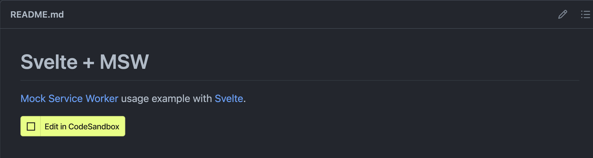

# Examples

A collection of usage examples of [Mock Service Worker](https://github.com/mswjs/msw).

### JavaScript frameworks

- [Angular](./examples/with-angular) (Jest, Cypress)
- Next.js
- React Native
- [Remix](./examples/with-remix) (Playwright)
- SolidJS
- [Svelte](./examples/with-svelte/) (Vitest, Playwright)
- [Vue](./examples/with-vue) (Vitest, Cypress)

### Test frameworks

- Cypress
- [Jest](./examples/with-jest)
- [Karma](./examples/with-karma)
- [Playwright](./examples/with-playwright)
- [Vitest](./examples/with-vitest) / [Vitest (CommonJS)](./examples/with-vitest-cjs)

### Other tools

- Storybook

## Reading examples

Each example is a standalone repository featuring the usage of MSW with a certain framework or tool. Follow the instructions written in the `README.md` of respective examples to integrate MSW with those particular technologies. Some examples have separate instructions for client-side and server-side integrations. You can choose either or _both_, depending on where you wish to gain control over the network with MSW. **We highly recommend implementing both client-side and server-side interception** to guarantee seamless development and testing experience.

## Cloning examples

Each example can be forked immediately with CodeSandbox. To do so, click on the "Edit on CodeSandbox" button in the `README.md` of the respective example. This will load it in the cloud, allowing you to experiment with the integration and create reproduction cases easier.

